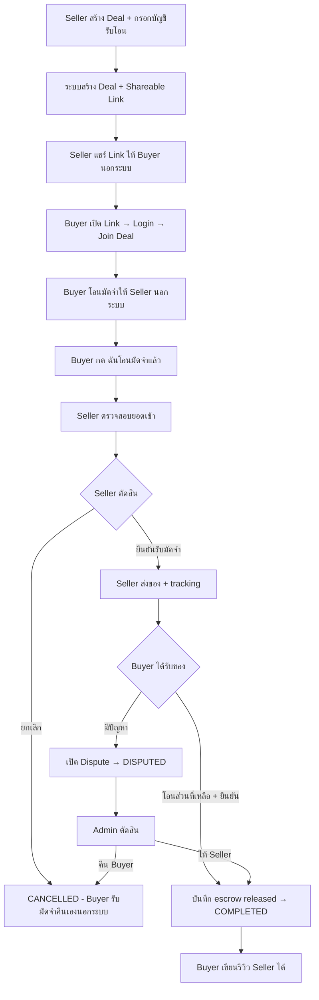
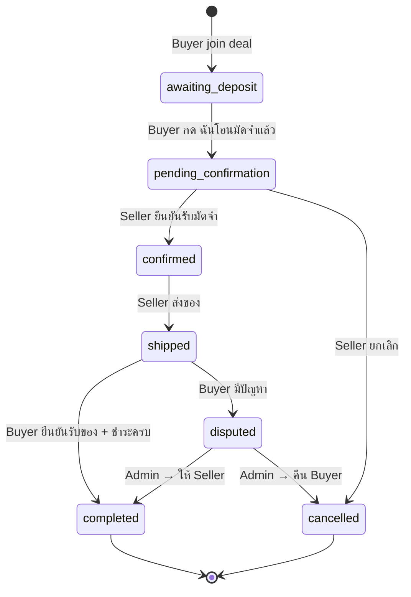
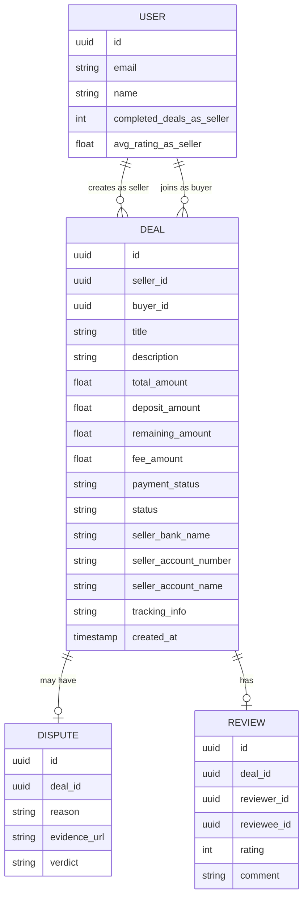
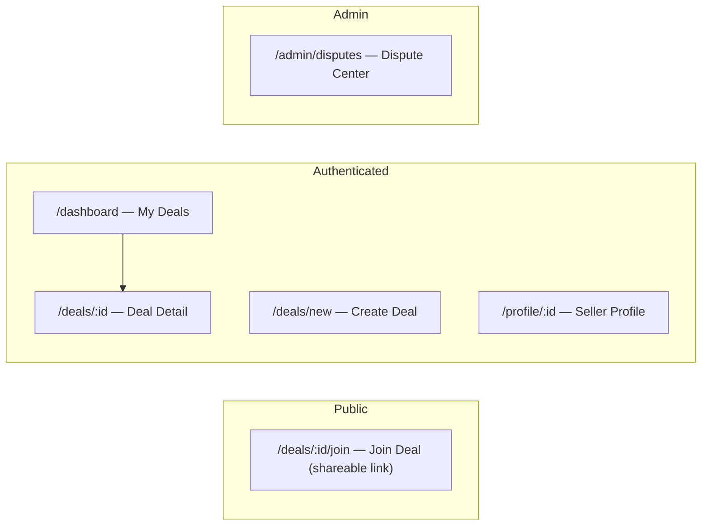

# GigGuard — Initial Requirements & Specification (1-Day Hackathon MVP)

**Project:** GigGuard DAO (Commerce Edition)
**Tagline:** The Trust Layer for Peer-to-Peer Transactions
**Date:** 2026-04-23
**Build mode:** Next.js + Supabase + Claude Code

---

## Scope Decision

ของเดิมใช้เวลา **3-5 วัน** — ตัด scope เหลือ **core demo loop** เดียวที่ judge เห็นคุณค่าได้ในครั้งเดียว

> **หลักการสำคัญ:** GigGuard **ไม่ใช่ marketplace** — ระบบไม่มีสินค้า ไม่มีร้านค้า ไม่รับออเดอร์ผ่านระบบ  
> GigGuard คือ **escrow middleman** ระหว่าง user A (ผู้ขาย) และ user B (ผู้ซื้อ) ที่ตกลงกันมาแล้วนอกระบบ (เช่น Facebook / Line)

| Feature | เดิม | 1-Day MVP | หมายเหตุ |
|---------|------|-----------|---------|
| Escrow Deal Flow (P2P) | ✅ | ✅ **KEEP** | หัวใจของระบบ |
| Buyer ยืนยันรับของ → Release | ✅ | ✅ **KEEP** | demo ได้ชัดเจน |
| Seller ยืนยันรับมัดจำ | ✅ | ✅ **KEEP** | flow สมบูรณ์ |
| Dispute (simplified) | ✅ | ✅ **KEEP** | เปิด + admin ตัดสิน |
| Verified Review | ✅ | ✅ **KEEP** | รีวิวต่อ deal เท่านั้น |
| Seller Trust Score + Badge | ✅ | ✅ **KEEP** | นับจาก completed deals |
| Shop / Product Catalog | ✅ | ❌ ตัดออก | ระบบไม่ใช่ marketplace |
| Hotel Booking flow | ✅ | ❌ Phase 2 | ซ้ำ flow + double ความซับซ้อน |
| Full Jury voting system | ✅ | ❌ Phase 2 | ซับซ้อนมาก |
| Auto-release timer (cron) | ✅ | ❌ Phase 2 | ต้องมี background job |
| Embeddable Widget (FB/Line) | ✅ | ❌ Phase 2 | scope ต่างหากทั้งหมด |

---

## 1. Problem Statement

ผู้ซื้อที่ซื้อของโดยตรงจากผู้ขายออนไลน์ (Facebook / Line / เว็บตรง) เสี่ยง:
- โดนโกง / ผู้ขายหนีเงิน
- สินค้าไม่ตรงปก
- รีวิวปลอมทำให้ตัดสินใจผิดพลาด

GigGuard แก้ปัญหานี้โดยทำหน้าที่เป็น **trusted escrow layer** — ผู้ขายสร้าง deal ใน GigGuard แชร์ link ให้ผู้ซื้อ ระบบล็อค workflow จนกว่าทั้งสองฝ่ายจะปฏิบัติตามเงื่อนไข

---

## 2. Functional Requirements (1-Day MVP)

### FR-01: Auth & Roles

| ID | Requirement |
|----|-------------|
| FR-01-1 | Sign up / Login ด้วย email + password (Supabase Auth) |
| FR-01-2 | ทุก user มี role เดียวคือ `user` — ไม่มี merchant/buyer ตาย-ตัวในระบบ |
| FR-01-3 | ภายใน deal: ผู้สร้าง deal = **Seller**, ผู้ join ผ่าน link = **Buyer** |
| FR-01-4 | Session-based auth ผ่าน Supabase |

### FR-02: Escrow Deal Flow (หัวใจระบบ)

> **Payment Model:** ระบบไม่จัดการเงินจริง — ผู้ใช้โอนเงินกันเองนอกระบบ  
> GigGuard ทำหน้าที่ **บันทึกสถานะการชำระ** และ **ล็อค workflow** ไม่ให้ฝั่งไหนดำเนินการต่อได้จนกว่าจะครบเงื่อนไข

#### FR-02-1: Seller สร้าง Deal

| ID | Requirement |
|----|-------------|
| FR-02-1a | Seller กรอก: ชื่อ/คำอธิบายรายการ (free text), ราคารวม, % มัดจำ (default 30%), ข้อมูลบัญชีรับโอน (ชื่อธนาคาร, เลขบัญชี, ชื่อเจ้าของบัญชี) |
| FR-02-1b | ระบบสร้าง Deal และ generate **Shareable Link** ให้ Seller นำไปส่งให้ Buyer นอกระบบ |
| FR-02-1c | Seller มี Dashboard แสดง deals ที่ตนสร้าง + สถานะแต่ละ deal |

#### FR-02-2: Buyer Join Deal

| ID | Requirement |
|----|-------------|
| FR-02-2a | Buyer เปิด link → Login/Register → เห็นรายละเอียด deal: คำอธิบาย, ยอดรวม, มัดจำ, fee 1%, บัญชีที่ต้องโอน |
| FR-02-2b | Buyer กด **"เข้าร่วม Deal นี้"** → ระบบผูก buyer_id กับ deal → status: `awaiting_deposit` |

#### FR-02-3: Deposit & Confirmation Workflow

| ID | Requirement |
|----|-------------|
| FR-02-3a | Buyer โอนมัดจำให้ Seller นอกระบบ → กลับมากด **"ฉันโอนมัดจำแล้ว"** → status: `pending_confirmation` |
| FR-02-3b | Seller ตรวจสอบว่าได้รับโอนจริง → กด **"ยืนยันรับมัดจำ"** → status: `confirmed` |
| FR-02-3c | Seller ส่งสินค้า/บริการ → กด **"ส่งแล้ว"** พร้อมใส่ tracking หรือหลักฐาน → status: `shipped` |
| FR-02-3d | Buyer ได้รับของ โอนเงินส่วนที่เหลือ → กด **"ยืนยันรับและชำระครบแล้ว"** → status: `completed` |
| FR-02-3e | Seller กด **"ยกเลิก Deal"** (ก่อน confirmed) → status: `cancelled` (Buyer รับมัดจำคืนเองนอกระบบ) |

**Payment fields ที่บันทึกใน DB:**
- `deposit_amount` — ยอดมัดจำ (% ของราคา, configurable)
- `remaining_amount` — ยอดที่เหลือชำระ
- `fee_amount` — 1% ของ total (แสดงให้เห็น, ไม่หักจริง)
- `payment_status` — `unpaid` → `deposit_paid` → `fully_paid`

### FR-03: Dispute (Simplified — ไม่มี Jury)

| ID | Requirement |
|----|-------------|
| FR-03-1 | Buyer กด "มีปัญหา / ไม่ตรงปก" แนบข้อความและ URL รูป |
| FR-03-2 | Deal เปลี่ยน status → `disputed`, เงินยังล็อคอยู่ |
| FR-03-3 | Admin page (protected route) เห็น dispute ทั้งหมด |
| FR-03-4 | Admin เลือก: "คืนเงิน Buyer" หรือ "ปลดให้ Seller" |

### FR-04: Verified Review & Trust Score

| ID | Requirement |
|----|-------------|
| FR-04-1 | Buyer รีวิวได้เฉพาะ Deal ที่ status = `completed` เท่านั้น |
| FR-04-2 | รีวิว: คะแนน 1-5 + ข้อความ |
| FR-04-3 | Profile ของ Seller แสดง avg rating, จำนวนรีวิว, จำนวน completed deals |
| FR-04-4 | ถ้า completed deals ≥ 10 และ avg rating ≥ 4.0 → แสดง "GigGuard Verified" badge บน profile และบน deal |

---

## 3. Non-Functional Requirements (MVP level)

| Category | Requirement |
|----------|-------------|
| Auth | Supabase Auth, Row Level Security (RLS) พื้นฐาน |
| Responsive | Mobile-first, ใช้งานได้บน phone |
| Payment | ไม่มี payment gateway — บันทึกสถานะการโอนใน DB เท่านั้น |
| Fee | คำนวณ 1% ของ total amount แสดงใน UI (ไม่หักจริง) |
| Deposit | % ของราคา deal (configurable, default 30%) |
| Shareable Link | `/deals/:id/join` เปิดได้โดยไม่ต้อง login ก่อน แต่ต้อง login เพื่อ join |

---

## 4. Tech Stack

| Layer | Technology |
|-------|-----------|
| Frontend + Backend | Next.js 14 (App Router + API Routes) |
| Database | Supabase (PostgreSQL + Auth) |
| Styling | Tailwind CSS (custom config ตาม design-template) |
| Font | Manrope (400, 600, 700, 800) จาก Google Fonts |
| Icons | Material Symbols Outlined จาก Google Fonts |

---

## 5. UI / Design System

> **MANDATORY:** ทุกหน้าต้องใช้ design token และ component pattern จาก `design-template/` เท่านั้น ห้ามออกแบบ UI ใหม่นอก spec นี้

### 5.1 Design System Reference

ไฟล์ spec หลัก: `design-template/secure_decentralized_trust/DESIGN.md`

**Theme name:** Secure Decentralized Trust  
**Brand personality:** Modern FinTech + Glassmorphism accent — institutional reliability + approachable

### 5.2 Tailwind Config (บังคับใช้)

ทุก project ต้อง extend `tailwind.config` ด้วย token ต่อไปนี้ทุกตัว:

**Colors:**
```js
colors: {
  "surface": "#f8f9ff",
  "surface-dim": "#cbdbf5",
  "surface-bright": "#f8f9ff",
  "surface-container-lowest": "#ffffff",
  "surface-container-low": "#eff4ff",
  "surface-container": "#e5eeff",
  "surface-container-high": "#dce9ff",
  "surface-container-highest": "#d3e4fe",
  "on-surface": "#0b1c30",
  "on-surface-variant": "#45464d",
  "inverse-surface": "#213145",
  "inverse-on-surface": "#eaf1ff",
  "outline": "#76777d",
  "outline-variant": "#c6c6cd",
  "surface-tint": "#565e74",
  "primary": "#000000",
  "on-primary": "#ffffff",
  "primary-container": "#131b2e",
  "on-primary-container": "#7c839b",
  "inverse-primary": "#bec6e0",
  "secondary": "#006c49",
  "on-secondary": "#ffffff",
  "secondary-container": "#6cf8bb",
  "on-secondary-container": "#00714d",
  "tertiary": "#000000",
  "on-tertiary": "#ffffff",
  "tertiary-container": "#001a42",
  "on-tertiary-container": "#3980f4",
  "error": "#ba1a1a",
  "on-error": "#ffffff",
  "error-container": "#ffdad6",
  "on-error-container": "#93000a",
  "background": "#f8f9ff",
  "on-background": "#0b1c30",
  "surface-variant": "#d3e4fe",
  "primary-fixed": "#dae2fd",
  "primary-fixed-dim": "#bec6e0",
  "on-primary-fixed": "#131b2e",
  "on-primary-fixed-variant": "#3f465c",
  "secondary-fixed": "#6ffbbe",
  "secondary-fixed-dim": "#4edea3",
  "on-secondary-fixed": "#002113",
  "on-secondary-fixed-variant": "#005236",
  "tertiary-fixed": "#d8e2ff",
  "tertiary-fixed-dim": "#adc6ff",
  "on-tertiary-fixed": "#001a42",
  "on-tertiary-fixed-variant": "#004395",
}
```

**Border Radius:**
```js
borderRadius: {
  "sm": "0.25rem",
  "DEFAULT": "0.5rem",
  "md": "0.75rem",
  "lg": "1rem",
  "xl": "1.5rem",
  "full": "9999px",
}
```

**Spacing:**
```js
spacing: {
  "base": "8px",
  "stack-sm": "12px",
  "stack-md": "24px",
  "stack-lg": "48px",
  "gutter": "24px",
  "margin": "32px",
  "container-max": "1280px",
}
```

**Font Family:**
```js
fontFamily: {
  sans: ["Manrope", "sans-serif"],
}
```

### 5.3 Page → Design Template Mapping (บังคับ)

แต่ละหน้าต้อง implement ตาม HTML template ที่กำหนดไว้ใน `design-template/` — ใช้ template เป็น visual reference สำหรับ layout, color class, spacing, และ icon ไม่ใช่ content จริง

| Page (Route) | Design Template (ดัดแปลงจาก) | ไฟล์อ้างอิง |
|---|---|---|
| `/dashboard` — My Deals (Seller + Buyer) | My Orders & Stays | `design-template/my_orders_stays/code.html` |
| `/deals/new` — Create Deal (Seller) | Secure Checkout & Escrow Setup | `design-template/secure_checkout/code.html` |
| `/deals/:id` — Deal Detail | Item Details (ดัดแปลงเป็น deal status + actions) | `design-template/item_details/code.html` |
| `/deals/:id/join` — Buyer Join Deal | Secure Checkout & Escrow Setup | `design-template/secure_checkout/code.html` |
| `/admin/disputes` — Dispute Center | Dispute Resolution Center | `design-template/dispute_center/code.html` |

> หมายเหตุ: `marketplace_home/code.html` ไม่ถูกใช้งานแล้วเนื่องจากระบบไม่มี marketplace — ใช้เป็น reference สำหรับ landing page `/` หรือ redirect ไป `/dashboard` แทน

### 5.4 Component Rules (บังคับ)

**Buttons:**
- Primary action (ยืนยัน, สร้าง deal, join): `bg-primary text-on-primary` + slight elevation on hover
- Success/Escrow action (ยืนยันรับสินค้า, release): `bg-secondary text-on-secondary`
- Ghost/Cancel: `border border-outline text-on-surface bg-transparent`

**Status Pills (Deal Status):**
- `awaiting_deposit`: `bg-surface-container-high text-on-surface-variant` rounded-full
- `pending_confirmation` / Action Required: `bg-error-container text-on-error-container` rounded-full
- `confirmed` / `shipped` / Secured: `bg-secondary-container text-on-secondary-container` rounded-full
- `completed`: `bg-secondary text-on-secondary` rounded-full
- `disputed`: `bg-error-container text-on-error-container` rounded-full
- `cancelled`: `bg-surface-container-high text-on-surface-variant` rounded-full

**GigGuard Verified Badge:**
- Shield icon จาก Material Symbols Outlined
- Dual-tone: `secondary` + glassmorphic background
- ต้องมี tooltip อธิบาย criteria (completed ≥ 10 + rating ≥ 4.0)

**Cards:**
- Border: `1px solid` `border-outline-variant` — ห้ามใช้ heavy drop shadow
- Background: `bg-surface-container-lowest` หรือ `bg-surface-container-low`
- Radius: `rounded-lg` (1rem)
- Shadow: `shadow-sm` (ambient, low-opacity เท่านั้น)

**Inputs:**
- Focus: 2px ring สี tertiary (`ring-2 ring-tertiary`)
- Background tint เปลี่ยนเล็กน้อยเมื่อ focus

**Escrow Progress Stepper:**
- แสดงบนหน้า Deal Detail
- Nodes เติม `secondary` เมื่อ milestone ผ่าน
- ขั้นตอน: Deal Created → Buyer Joined → Deposit Sent → Seller Confirmed → Shipped → Received & Paid

### 5.5 Typography Scale (บังคับ)

| Role | Spec |
|---|---|
| Hero / Page Title | Manrope 48px 800 weight |
| Section Header | Manrope 32px 700 weight |
| Card Title | Manrope 24px 600 weight |
| Body Text | Manrope 18px/16px 400 weight |
| Label / Badge | Manrope 14px/12px 600-700 weight |

### 5.6 Layout Rules

- Max content width: `max-w-[1280px] mx-auto`
- Horizontal padding: `px-gutter` (24px)
- Top-level vertical spacing ระหว่าง section: `py-stack-lg` (48px)
- ระหว่าง card group: `space-y-stack-md` (24px)
- Mobile-first; template ใช้ responsive breakpoints ตาม Tailwind defaults

### 5.7 Icons

ต้องใช้ **Material Symbols Outlined** เท่านั้น โหลดจาก Google Fonts:
```html
<link href="https://fonts.googleapis.com/css2?family=Material+Symbols+Outlined:wght,FILL@100..700,0..1&display=swap" rel="stylesheet"/>
```
ใช้ผ่าน `<span class="material-symbols-outlined">icon_name</span>`

---

## 6. System Diagrams

### 6.1 Core Escrow Flow (MVP)



### 6.2 Deal Status State Machine



### 6.3 Entity Relationship (MVP DB)



### 6.4 Page Structure



---

## 7. Estimated Build Timeline (1 Day)

| ช่วงเวลา | งาน |
|----------|-----|
| 09:00–10:00 | Setup Next.js + Supabase + Tailwind config (design tokens), Auth, DB schema |
| 10:00–11:30 | Create Deal flow (FR-02-1): Seller form + shareable link generation |
| 11:30–12:30 | Join Deal flow (FR-02-2): Public join page + buyer join |
| 12:30–13:00 | Break |
| 13:00–15:00 | Escrow workflow (FR-02-3): deposit → confirm → ship → complete + Deal Detail page |
| 15:00–16:30 | Dispute flow (FR-03) + Admin page |
| 16:30–17:30 | Review system (FR-04) + Trust Score + Verified Badge |
| 17:30–18:00 | Dashboard (My Deals) + Seller Profile |
| 18:00–19:00 | UI polish, Bug fix, Demo script |

---

## 8. Scope Summary Test

| Feature | MVP (วันนี้) | Phase 2 |
|---------|-------------|---------|
| Seller สร้าง Deal + Shareable Link | ✅ | |
| Buyer Join Deal ผ่าน Link | ✅ | |
| Escrow deposit → confirm → ship → complete | ✅ | |
| Seller cancel deal | ✅ | |
| Simplified dispute + admin | ✅ | |
| Verified review (post-deal only) | ✅ | |
| Seller Trust Score + Verified badge | ✅ | |
| Mock payment (track status only) | ✅ | |
| Shop / Product Catalog | ❌ ไม่ทำ | |
| Real payment gateway | | ✅ |
| Hotel booking flow | | ✅ |
| Full Jury voting system | | ✅ |
| Auto-release timer (cron) | | ✅ |
| Embeddable Widget (FB/Line) | | ✅ |
| Blockchain / Smart Contract | | ✅ |
