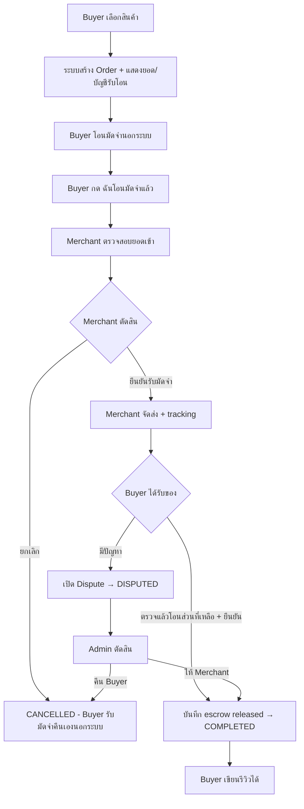
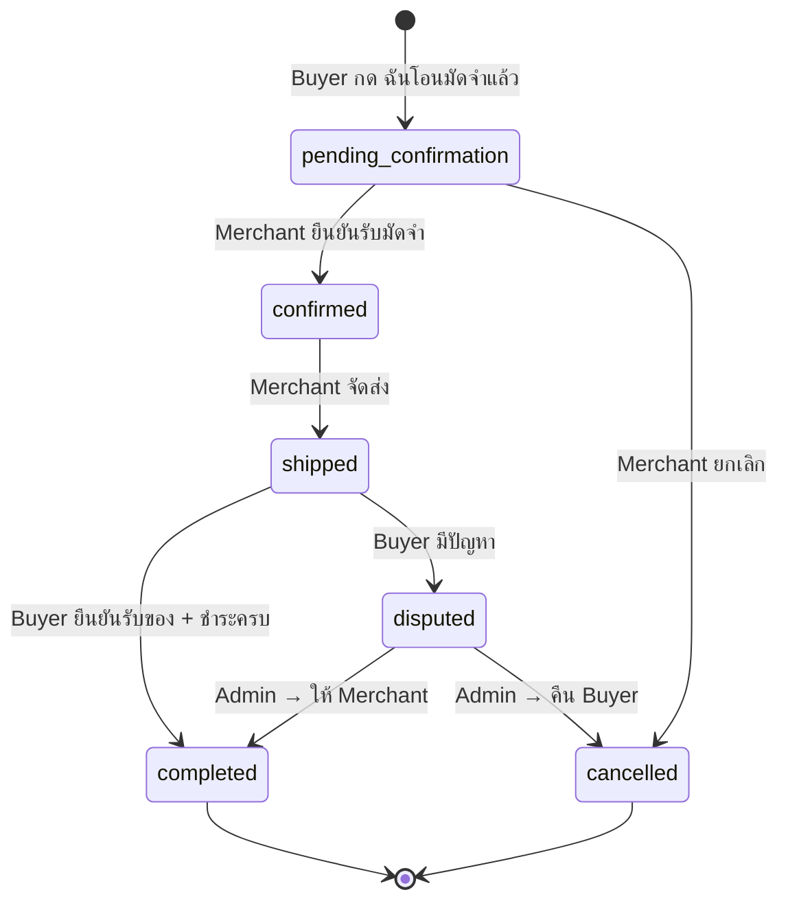
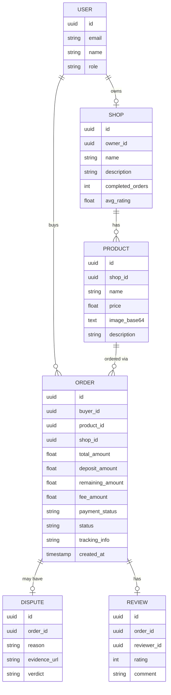

# GigGuard — Initial Requirements & Specification (1-Day Hackathon MVP)

**Project:** GigGuard DAO (Commerce Edition)
**Tagline:** The Trust Layer for Direct Booking & Marketplace
**Date:** 2026-04-23
**Build mode:** Next.js + Supabase + Claude Code

---

## Scope Decision

ของเดิมใช้เวลา **3-5 วัน** — ตัด scope เหลือ **core demo loop** เดียวที่ judge เห็นคุณค่าได้ในครั้งเดียว

| Feature | เดิม | 1-Day MVP | เหตุผลที่ตัด |
|---------|------|-----------|-------------|
| Escrow (สั่งสินค้า) | ✅ | ✅ **KEEP** | หัวใจของระบบ |
| Buyer ยืนยันรับของ → Release | ✅ | ✅ **KEEP** | demo ได้ชัดเจน |
| Seller ยืนยันรับออเดอร์ | ✅ | ✅ **KEEP** | flow สมบูรณ์ |
| Dispute (simplified) | ✅ | ✅ **KEEP** | เปิด + admin ตัดสิน |
| Verified Review | ✅ | ✅ **KEEP** | ง่าย มีคุณค่า |
| Merchant Trust Score + Badge | ✅ | ✅ **KEEP** | นับจาก completed orders |
| Hotel Booking flow | ✅ | ❌ Phase 2 | ซ้ำ flow + double ความซับซ้อน |
| Full Jury voting system | ✅ | ❌ Phase 2 | ซับซ้อนมาก (pool + vote + deadline) |
| Auto-release timer (cron) | ✅ | ❌ Phase 2 | ต้องมี background job |
| Embeddable Widget (FB/Line) | ✅ | ❌ Phase 2 | scope ต่างหากทั้งหมด |

---

## 1. Problem Statement

ผู้ซื้อที่ซื้อของโดยตรงจากร้านค้าออนไลน์ (Facebook / Line / เว็บตรง) เสี่ยง:
- โดนโกง / ร้านหนีเงิน
- สินค้าไม่ตรงปก
- รีวิวปลอมทำให้ตัดสินใจผิดพลาด

---

## 2. Functional Requirements (1-Day MVP)

### FR-01: Auth & Roles

| ID | Requirement |
|----|-------------|
| FR-01-1 | Sign up / Login ด้วย email + password (Supabase Auth) |
| FR-01-2 | Role: `buyer` หรือ `merchant` เลือกตอน register |
| FR-01-3 | Session-based auth ผ่าน Supabase |

### FR-02: Merchant — สร้างร้านและสินค้า

| ID | Requirement |
|----|-------------|
| FR-02-1 | Merchant สร้าง Shop profile (ชื่อร้าน, รายละเอียด) |
| FR-02-2 | Merchant เพิ่มสินค้า (ชื่อ, ราคา, รูป URL, รายละเอียด) |
| FR-02-3 | Merchant มี dashboard ดูออเดอร์ที่เข้ามา |

### FR-03: Escrow Order Flow (หัวใจระบบ)

> **Payment Model:** ระบบไม่ได้จัดการเงินจริง — ผู้ใช้โอนเงินกันเองนอกระบบ  
> GigGuard ทำหน้าที่ **บันทึกสถานะการชำระ** และ **ล็อค workflow** ไม่ให้ฝั่งไหนดำเนินการต่อได้จนกว่าจะครบเงื่อนไข

| ID | Requirement |
|----|-------------|
| FR-03-1 | Buyer เห็นหน้าร้านและกด "สั่งซื้อผ่าน GigGuard" |
| FR-03-2 | ระบบสร้าง Order แสดงยอดรวม, มัดจำ, fee 1%, และข้อมูลบัญชีของ Merchant ที่ต้องโอน |
| FR-03-3 | Buyer โอนเงินมัดจำให้ Merchant นอกระบบ → กลับมากด **"ฉันโอนมัดจำแล้ว"** → status: `pending_confirmation` |
| FR-03-4 | Merchant เห็น order → ตรวจสอบว่าได้รับโอนจริง → กด **"ยืนยันรับมัดจำ"** → status: `confirmed` |
| FR-03-5 | Merchant จัดส่งสินค้า → กด **"จัดส่งแล้ว"** พร้อมใส่ tracking → status: `shipped` |
| FR-03-6 | Buyer ได้รับของ ตรวจสอบแล้วโอนเงินส่วนที่เหลือ → กด **"ยืนยันรับสินค้าและชำระครบแล้ว"** → ระบบบันทึก escrow released → status: `completed` |
| FR-03-7 | Merchant กด **"ยกเลิกออเดอร์"** (ก่อน confirmed) → status: `cancelled` (Buyer รับเงินมัดจำคืนเองนอกระบบ) |

**Payment fields ที่บันทึกใน DB:**
- `deposit_amount` — ยอดมัดจำ (% ของราคา, configurable)
- `remaining_amount` — ยอดที่เหลือชำระ
- `fee_amount` — 1% ของ total (แสดงให้เห็น)
- `payment_status` — `unpaid` → `deposit_paid` → `fully_paid`

### FR-04: Dispute (Simplified — ไม่มี Jury)

| ID | Requirement |
|----|-------------|
| FR-04-1 | Buyer กด "มีปัญหา / ไม่ตรงปก" แนบข้อความและ URL รูป |
| FR-04-2 | Order เปลี่ยน status → `disputed`, เงินยังล็อคอยู่ |
| FR-04-3 | Admin page (protected route) เห็น dispute ทั้งหมด |
| FR-04-4 | Admin เลือก: "คืนเงิน Buyer" หรือ "ปลดให้ Merchant" |

### FR-05: Verified Review & Trust Score

| ID | Requirement |
|----|-------------|
| FR-05-1 | Buyer รีวิวได้เฉพาะ Order ที่ status = `completed` เท่านั้น |
| FR-05-2 | รีวิว: คะแนน 1-5 + ข้อความ |
| FR-05-3 | หน้าร้านแสดง avg rating, จำนวนรีวิว, จำนวน completed orders |
| FR-05-4 | ถ้า completed orders ≥ 10 และ avg rating ≥ 4.0 → แสดง "GigGuard Verified" badge |

---

## 3. Non-Functional Requirements (MVP level)

| Category | Requirement |
|----------|-------------|
| Auth | Supabase Auth, Row Level Security (RLS) พื้นฐาน |
| Responsive | Mobile-first, ใช้งานได้บน phone |
| Payment | ไม่มี payment gateway — บันทึกสถานะการโอนใน DB เท่านั้น |
| Fee | คำนวณ 1% ของ total amount แสดงใน UI (ไม่หักจริง) |
| Deposit | % ของราคาสินค้า (configurable, default 30%) |

---

## 4. Tech Stack

| Layer | Technology |
|-------|-----------|
| Frontend + Backend | Next.js 14 (App Router + API Routes) |
| Database | Supabase (PostgreSQL + Auth) |
| Styling | Tailwind CSS |
| Image | เก็บเป็น base64 string ใน DB column (text), resize ก่อน upload ไม่เกิน 100KB |

---

## 5. System Diagrams

### 5.1 Core Escrow Flow (MVP)



### 5.2 Order Status State Machine



### 5.3 Entity Relationship (MVP DB)



### 5.4 Page Structure

```mermaid
flowchart LR
    subgraph Public
        P1[/] --> P2[/shop/:id]
        P2 --> P3[/shop/:id/product/:id]
    end
    subgraph Buyer
        B1[/orders] --> B2[/orders/:id]
    end
    subgraph Merchant
        M1[/dashboard] --> M2[/dashboard/orders]
        M1 --> M3[/dashboard/products]
    end
    subgraph Admin
        A1[/admin/disputes]
    end
```

---

## 6. Estimated Build Timeline (1 Day)

| ช่วงเวลา | งาน |
|----------|-----|
| 09:00–10:30 | Setup Next.js + Supabase + Tailwind, Auth, DB schema |
| 10:30–12:30 | Merchant: สร้างร้าน, เพิ่มสินค้า, Dashboard |
| 12:30–13:00 | Break |
| 13:00–15:30 | Buyer: หน้าร้าน, สั่งซื้อ, Escrow flow, Order status |
| 15:30–17:00 | Dispute flow + Admin page |
| 17:00–18:00 | Review system + Trust Score + Badge |
| 18:00–19:00 | UI polish, Bug fix, Demo script |

---

## 7. Scope Summary

| Feature | MVP (วันนี้) | Phase 2 |
|---------|-------------|---------|
| Escrow order flow (สินค้า) | ✅ | |
| Merchant confirm / ship / cancel | ✅ | |
| Buyer confirm receipt | ✅ | |
| Simplified dispute + admin | ✅ | |
| Verified review (post-purchase only) | ✅ | |
| Trust Score + Verified badge | ✅ | |
| Mock payment | ✅ | |
| Real payment gateway | | ✅ |
| Hotel booking flow | | ✅ |
| Full Jury voting system | | ✅ |
| Auto-release timer (cron) | | ✅ |
| Embeddable Widget | | ✅ |
| Blockchain / Smart Contract | | ✅ |
